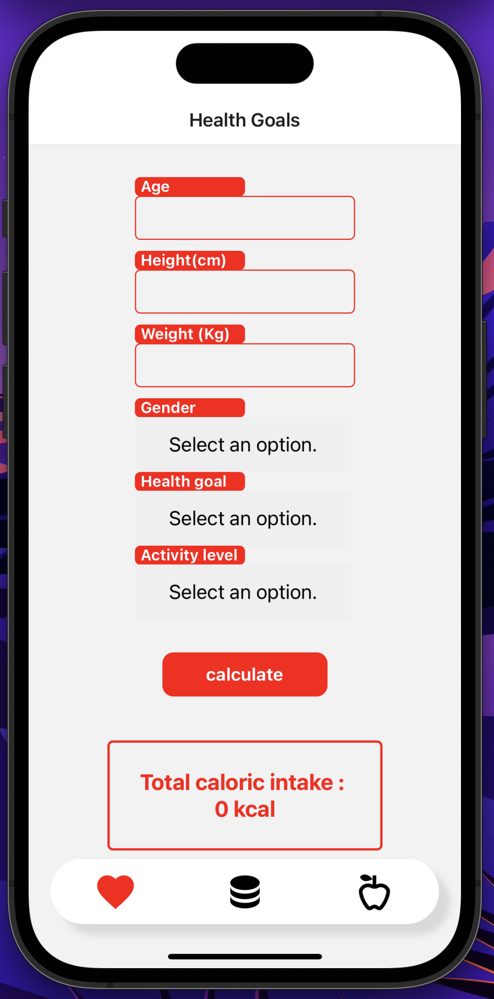
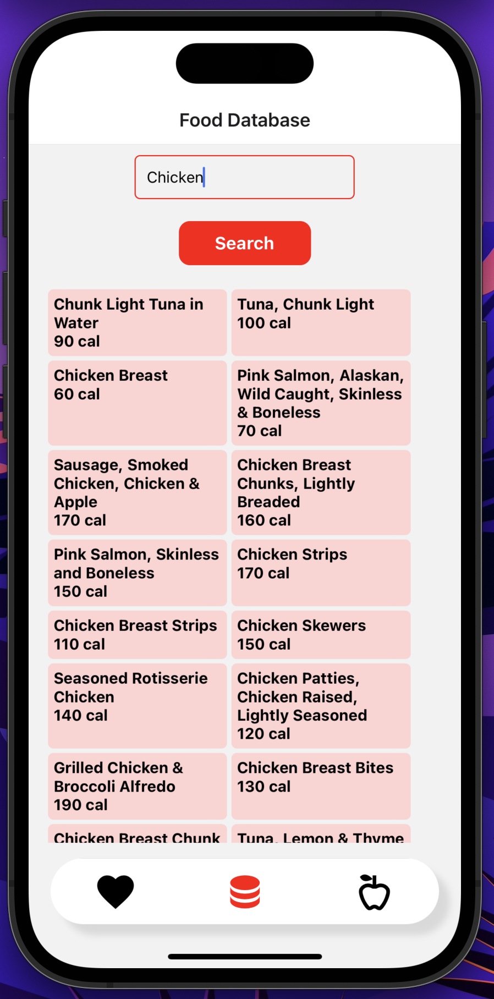
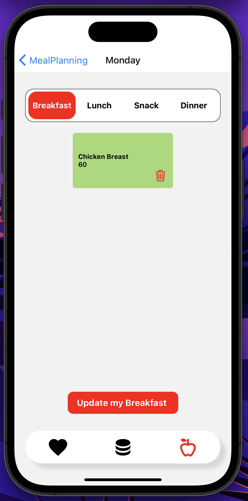
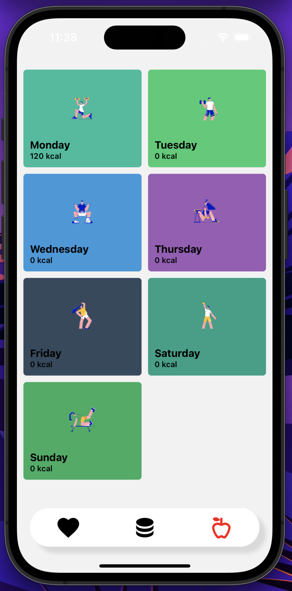

# NutriTrack

## Description
A React Native app for tracking calories and planning meals. Set goals, track food intake, and plan meals.

## Features
- plan your daily meals for each week.
- add a range of food types from the api.
- calulate the daily caloric intake.

## Installation
1. Clone the repository.
2. Navigate to the project directory.
3. Install dependencies using the package manager of your choice (e.g., npm, yarn).

## Usage

`npm expo start`

following this commande will allow you either use your browser or your personal phone

## Dependencies

- "@expo/webpack-config": "^18.0.1"
- "@react-native-async-storage/async-storage": "1.17.11"
- "@react-native-community/datetimepicker": "6.7.3"
- "@react-native-picker/picker": "2.4.8"
- "@react-navigation/bottom-tabs": "^6.5.7"
- "@react-navigation/drawer": "^6.6.2"
- "@react-navigation/native": "^6.1.6"
- "@react-navigation/native-stack": "^6.9.12"
- "@react-navigation/stack": "^6.3.16"
- "axios": "^1.4.0"
- "expo": "^48.0.0"
- "expo-splash-screen": "~0.18.2"
- "expo-status-bar": "~1.4.4"
- "randomcolor": "^0.6.2"
- "react": "18.2.0"
- "react-dom": "18.2.0"
- "react-native": "0.71.8"
- "react-native-paper": "^5.8.0"
- "react-native-safe-area-context": "4.5.0"
- "react-native-select-dropdown": "^3.3.3"
- "react-native-super-grid": "^5.0.0"
- "react-native-vector-icons": "^9.2.0"
- "react-native-web": "~0.18.11"

## Screenshots

  
  

## Contributors

- [@hzmagm](https://github.com/hzmagm)

- [@annoui](https://github.com/annoui)
